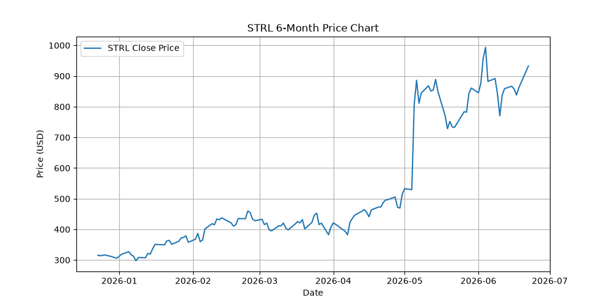
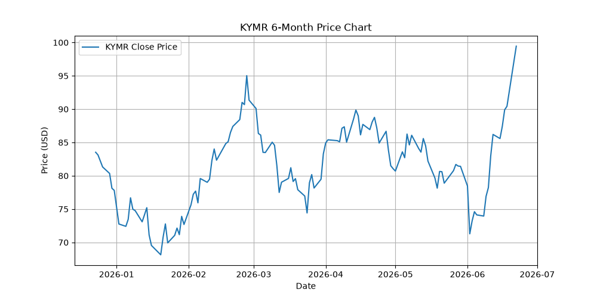

# 📈 종목 추천 및 투자 전략 (2026-06-23)

## 📌 오늘의 추천 종목: STRL (Sterling Infrastructure), KYMR (Kymera Therapeutics)

이 보고서는 RS (Relative Strength) 투자 전략 중 **'응봉아재보소'** 및 **'Perfect Storm'** 전략을 기반으로 가장 모멘텀이 강력하고 재무적 펀더멘털이 우수한 종목을 필터링한 결과입니다.

---

### 1. STRL (Sterling Infrastructure) - 🏭 Industrials
**전략 적용**: 👨‍🏫 응봉아재보소 (눌림목 및 실적 상승 주도주)

- **추천 사유**:
  - **재무 건전성 및 성장세**: 매출액이 꾸준히 성장 중이며 (2.11B -> 2.49B), 당기순이익(Net Income) 역시 257M에서 290M으로 탄탄한 증가세를 보이고 있습니다. Free Cash Flow(잉여현금흐름)도 강력한 양(+)의 흐름을 유지하고 있어 사업 수익 모델이 확실하게 작동 중입니다.
  - **차트 및 수급**: 중장기 정배열 상태를 유지 중이며 50일 이동평균선 근처(50DIV 30% 이내)에서 지지를 받으며 올라오는 이상적인 눌림목 매수 타점을 형성하고 있습니다.
  - **모멘텀**: 상대강도(RS 6mo) 기준 1.94로, 시장 대비 압도적인 아웃퍼폼(Outperform)을 기록 중입니다.

---

### 2. KYMR (Kymera Therapeutics) - 🧬 Healthcare / Biotechnology
**전략 적용**: ⚡ Perfect Storm 전략 (신고가 돌파 셋업)

- **추천 사유**:
  - **차트 및 수급 폭발력**: 52주 고점 대비 80% 이상 상단에 위치해 있어 악성 매물이 거의 없는 신고가 영역에 진입했습니다.
  - **변동성 및 모멘텀**: 최근 3개월간 저점 대비 최대 상승률(Max Rise 3M)이 30%를 상회하며, 당일 거래대금 폭발(VOL_X > 2.0)을 동반한 확실한 60일 신고가 돌파(60D BRK: YES) 캔들을 형성했습니다. 기관의 수급 쏠림이 뚜렷하게 관찰되는 전형적인 '힘과 거래 대금의 쏠림'을 입증한 주도주입니다.
  - *참고*: 바이오 섹터 특성상 적자가 지속 중이나, 시장은 파이프라인 기대감과 강력한 펀더멘털 모멘텀을 반영해 급등 중이므로 철저한 기술적 대응(손절라인 세팅)이 동반되어야 합니다.

---

### 💡 최종 투자 전략
1. **STRL (비중 확대)**: 안정적인 실적 모멘텀이 뒷받침되는 만큼 저항선 돌파 후 지지 여부를 확인하며 분할 매수. 단기뿐 아니라 중장기 스윙으로도 적합합니다.
2. **KYMR (단기 트레이딩)**: 전형적인 돌파 셋업이므로 1차 매수 진입 후, 돌파 캔들의 저점이나 10일선 이탈 시 칼같이 손절하는 원칙으로 '달리는 말에 올라타기' 전략 수행.

> **면책 조항 (Disclaimer):** 이 추천은 데이터 및 퀀트 룰 베이스에 기반한 것으로, 실제 투자 책임은 본인에게 있습니다. 반드시 장중 흐름을 확인하고 진입하세요.
